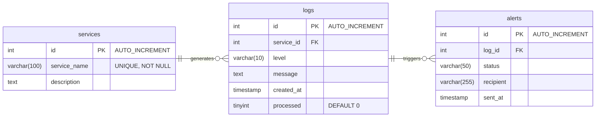

Notes:
- Indexes implemented in `db/init.sql` for performance:
    - `idx_service_level (service_id, level)` — accelerate queries filtering by service and level.
    - `idx_created_at (created_at)` — used by retention/cleanup operations.
    - `idx_processed_level (processed, level)` — optimizes worker selection of unprocessed error logs.
- Alerts foreign key: `alerts.log_id` references `logs.id` with `ON DELETE CASCADE` (alerts are removed when the related log is deleted).
- Retention policy: stored procedure `sp_cleanup_logs()` removes logs older than 30 days; a scheduled event `purge_old_logs` calls it daily at ~03:00 (configured in `db/init.sql`).
